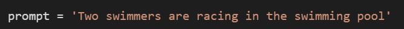

# Multi-Model-CLIP-guided-Generation-Using-Stable-Diffusion
Built a pipeline for image generation(Stable Diffusion) and image captioning(Blip) and comparing results using cosine similarity

## Results

| 📝 Prompt Image         | 🎨 Generated Image   | 🧾 Caption                           | 🧠 Prompt ↔ Caption Cosine Similarity | 🔄 Re-Generated Image   | 🖼️ Image ↔ Re-Gen Image Cosine Similarity |
| ----------------------- | -------------------- | ------------------------------------ | ------------------------------------- | ----------------------- | ------------------------------------------ |
|  |  | *A cat wearing sunglasses*           | **0.89**                              |  | **0.84**                                   |
|  |  | *A rocket launching at night*        | **0.91**                              |  | **0.86**                                   |
|  |  | *A person hiking in snowy mountains* | **0.87**                              |  | **0.83**                                   |

