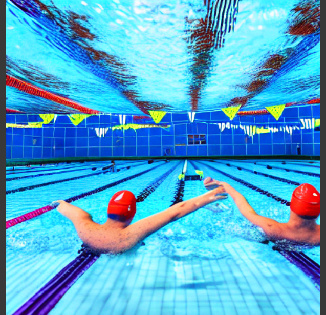
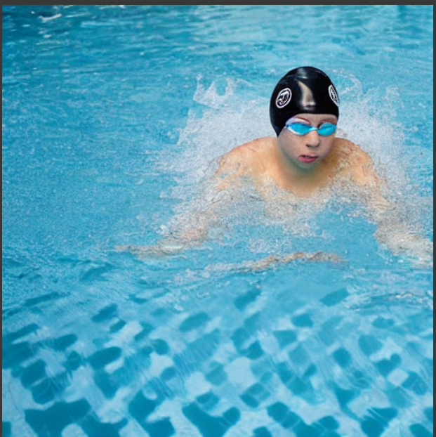
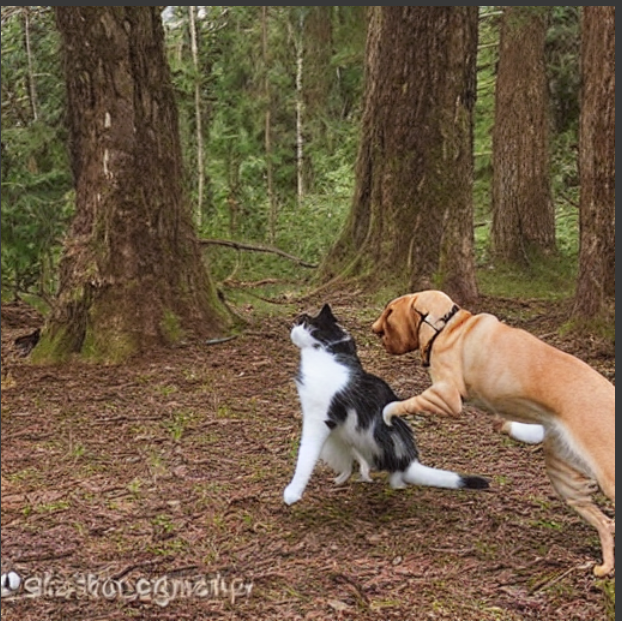
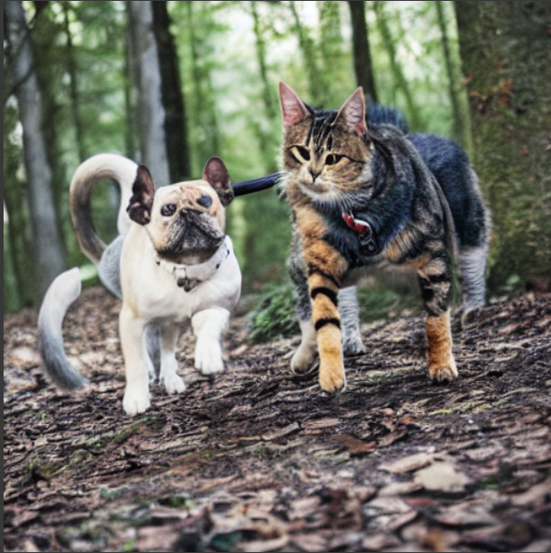
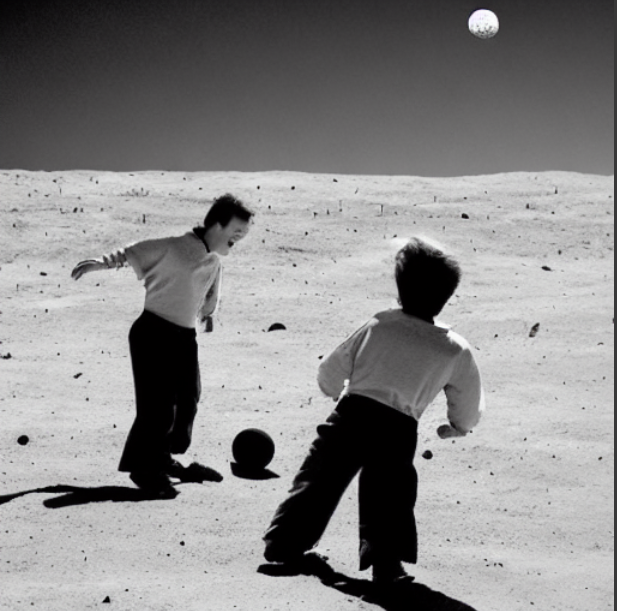

# Multi-Model-CLIP-guided-Generation-Using-Stable-Diffusion
Built a pipeline for image generation(Stable Diffusion) and image captioning(Blip) and comparing results using cosine similarity

## Results

| 📝 Prompt  | 🎨 Gen Image | 🧾 Caption | 🎨 Re-Gen Image |
|----------------|--------------|------------|-----------------|
| **Two swimmwers are racing in the swimming pool** |  | **a swimmer in the pool** |  |
|  |  |  |  |
|  |  |  |  |

