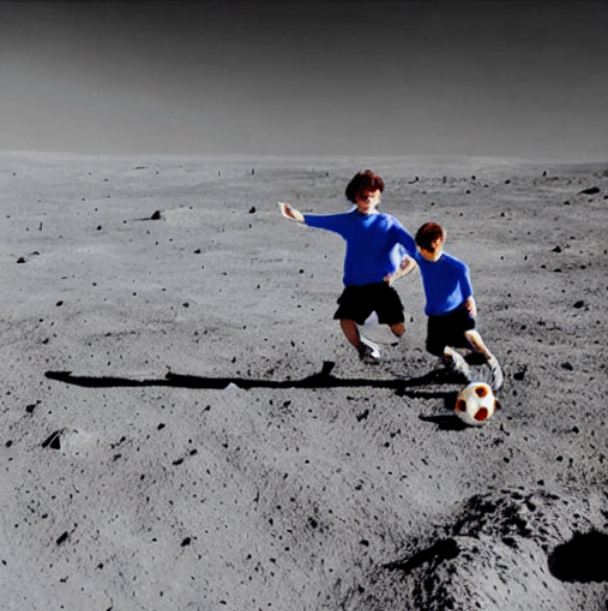

# Multi-Model-CLIP-guided-Generation-Using-Stable-Diffusion
Built a pipeline for image generation(Stable Diffusion) and image captioning(Blip) and comparing results using cosine similarity

## Results

|  Prompt  |  Gen Image |  Caption |  Re-Gen Image |
|----------------|--------------|------------|-----------------|
| **Two swimmwers are racing in the swimming pool** |  | **a swimmer in the pool** |  |
| **A cat and a dog fighting in the forest** |  | **a dog and a cat playing in the woods** |  |
| **Two boys playing football on the moon** |  | **two boys playing soccer on moon** |  |
| **A boys swimming gin the pool** |  | **a boy in a pool** |  |

